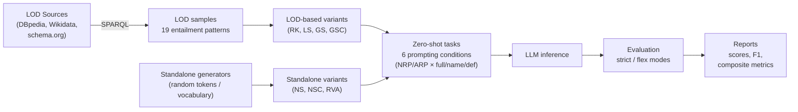

# RDFS-LLM-Bench

[](LICENSE)
[](LICENSE-DATA)
[](https://doi.org/10.5281/zenodo.19867258)

LLM における RDF Schema 推論を評価するためのベンチマークです。

英語版: [README.md](README.md)

> **重要。** Zenodo Version 4.0.0 をご利用ください。本バージョンが論文で報告した結果に対応します。

---

## 目次

- [概要](#概要)
- [アーキテクチャ](#アーキテクチャ)
- [RDFS Entailment Rules](#rdfs-entailment-rules)
- [entailment pattern ごとの取得可能サンプル数](#entailment-pattern-ごとの取得可能サンプル数)
- [Dataset Variants](#dataset-variants)
- [Presented Rule Type と Rule Format](#presented-rule-type-と-rule-format)
- [ディレクトリ構成](#ディレクトリ構成)
- [クイックスタート: 既存データセットで LLM を評価する](#クイックスタート-既存データセットで-llm-を評価する) — 既成のデータセットを使う
- [フルビルド: LOD ソースからデータセットを構築する](#フルビルド-lod-ソースからデータセットを構築する) — 自分でデータセットを構築する
- [LLM 評価パイプライン](#llm-評価パイプライン) — 両パスの共通部分
- [データフォーマット](#データフォーマット)
- [ファイル命名規則](#ファイル命名規則)
- [トラブルシューティング](#トラブルシューティング)
- [制限事項](#制限事項)
- [メンテナンスと持続可能性](#メンテナンスと持続可能性)
- [ライセンス](#ライセンス)

---

## 概要

RDFS-LLM-Bench は LLM の RDFS 推論能力を体系的に評価するためのベンチマークです。
6つのコア RDFS entailment rule（rdfs2, rdfs3, rdfs5, rdfs7, rdfs9, rdfs11）に加えて
13個の複数ルール組み合わせを扱い、合計 19 種類の entailment pattern（1-rule 6 種 + 2-rule 7 種 + 3-rule 6 種）を網羅します。
評価は 7 種類の dataset variant に対し、2 種類の Presented Rule Type × 3 種類の Rule Format
（= 6 通りの prompting condition）で行います。

---

## アーキテクチャ



LOD ソースのトリプルを SPARQL でサンプリングして 19 entailment pattern の LOD samples を生成し、4 つの LOD ベース dataset variant (RK, LS, GS, GSC) へと変換します。並行して、3 つの standalone variant (NS, NSC, RVA) はプログラム的に生成します。全 7 variant を 6 prompting condition の zero-shot task としてレンダリングし、LLM の出力を strict / flex モードで評価し、モデル別スコアと 7 種類の composite metrics (RI, SI, RRS, SRS, VR, TR, RDI) として集計します。

---

## RDFS Entailment Rules

| Rule | If … | Then … |
|---|---|---|
| rdfs2 | `<i, rdfs:domain, X>` and `<a, i, b>` | `<a, rdf:type, X>` |
| rdfs3 | `<i, rdfs:range, X>` and `<a, i, b>` | `<b, rdf:type, X>` |
| rdfs5 | `<i, rdfs:subPropertyOf, j>` and `<j, rdfs:subPropertyOf, k>` | `<i, rdfs:subPropertyOf, k>` |
| rdfs7 | `<i, rdfs:subPropertyOf, j>` and `<a, i, b>` | `<a, j, b>` |
| rdfs9 | `<X, rdfs:subClassOf, Y>` and `<a, rdf:type, X>` | `<a, rdf:type, Y>` |
| rdfs11 | `<X, rdfs:subClassOf, Y>` and `<Y, rdfs:subClassOf, Z>` | `<X, rdfs:subClassOf, Z>` |

複数ルールの entailment pattern（13 種類 = 2-rule 7 種 + 3-rule 6 種）: rdfs2\_3, rdfs2\_7, rdfs2\_9, rdfs3\_7, rdfs3\_9, rdfs5\_7, rdfs9\_11, rdfs2\_3\_7, rdfs2\_3\_9, rdfs2\_5\_7, rdfs2\_9\_11, rdfs3\_5\_7, rdfs3\_9\_11

---

## entailment pattern ごとの取得可能サンプル数

ベンチマーク構築時に、各データソース戦略から取得できたサンプル数です。
**Source** は各パターンで採用した戦略を表します。

- **DBP** — DBpedia のみ
- **DBP&WD** — DBpedia + Wikidata
- **WD&SO** — Wikidata + schema.org

プロパティ階層を含むパターン（`rdfs5`、`rdfs7` およびそれらの組み合わせ）は DBpedia 単独では
十分なサンプルが得られないため、これらのパターンでは Wikidata と schema.org を用いています。

| Pattern | Source | DBP | DBP&WD | WD&SO |
|---|---|---:|---:|---:|
| rdfs2 | DBP | 22,888 | – | – |
| rdfs3 | DBP | 39,808 | – | – |
| rdfs5 | WD&SO | 8 | – | 406 |
| rdfs7 | DBP&WD | 168 | 2,896,964 | – |
| rdfs9 | DBP | 695,012 | – | – |
| rdfs11 | DBP | 576 | – | – |
| rdfs2\_3 | DBP | 18,410 | – | – |
| rdfs2\_7 | DBP | 484 | – | – |
| rdfs2\_9 | DBP | 16,040 | – | – |
| rdfs3\_7 | DBP&WD | 125 | 3,767,791 | – |
| rdfs3\_9 | DBP | 22,397 | – | – |
| rdfs5\_7 | DBP&WD | 0 | 1,696,602 | – |
| rdfs9\_11 | DBP | 159,632 | – | – |
| rdfs2\_3\_7 | DBP&WD | 112 | 6,199,720 | – |
| rdfs2\_3\_9 | DBP | 5,477 | – | – |
| rdfs2\_5\_7 | DBP&WD | 0 | 222,408 | – |
| rdfs2\_9\_11 | DBP | 7,852 | – | – |
| rdfs3\_5\_7 | DBP&WD | 0 | 3,393,204 | – |
| rdfs3\_9\_11 | DBP | 15,480 | – | – |

---

## Dataset Variants

| Variant | Source | 説明 |
|---|---|---|
| `rk` | LOD samples | Real-world Knowledge: DBpedia/Wikidata/schema.org の実世界トリプルをそのまま使用 |
| `ls` | LOD samples | Local resource Swapping/Shuffling: エントリ内で主語/目的語・プロパティの domain/range・クラス/プロパティ階層を局所的に置換 |
| `gs` | LOD samples | Global resource Shuffling: 全リソースをグローバルにシャッフルして再割り当て |
| `gsc` | LOD samples | GS with Case Conversion: `gs` の各名前を該当型の DBpedia 命名規則へ変換（クラス: PascalCase, インスタンス: Upper_Snake_Case, プロパティ: camelCase）|
| `ns` | Standalone | Non-Semantic: 全リソーススロットにランダム8文字英数字トークン |
| `nsc` | Standalone | NS with Case Conversion: 各型の DBpedia 命名規則に従うランダムトークン（PascalCase / Upper_Snake_Case / camelCase）|
| `rva` | Standalone | Random Vocabulary Assignment: リソース種別ごとに DBpedia ローカル名をランダムに割り当て |

---

## Presented Rule Type と Rule Format

各データセットエントリには 1 つのプロンプトが対応付けられます。プロンプトの内容は **Presented Rule Type (PRT)** と **Rule Format** の 2 軸で決まります。

| PRT | 略称 | 説明 |
|---|---|---|
| Necessary Rule Presentation | NRP | 推論タスクに必要なルール（群）を与え、モデルがそれを前提知識に適用する |
| All-Rule Presentation | ARP | 全 RDFS ルールを与え、モデルが必要なものを選択・適用する |

各 PRT は次の 3 つの Rule Format のいずれかと組み合わせて使います。

| Format | Suffix | モデルへの提示内容 |
|---|---|---|
| Full | `-full` | ルール名 + 定義 |
| Name only | `-name` | ルール名のみ |
| Definition only | `-def` | 定義のみ |

PRT と Rule Format を組み合わせると合計 6 通りの prompting condition になります。CLI 引数・ファイルパス・JSON の `prompting_condition` フィールドでは `{PRT}-{rule_format}` の形式で表記します:
`NRP-full`, `NRP-name`, `NRP-def`, `ARP-full`, `ARP-name`, `ARP-def`。

---

## ディレクトリ構成

```
scripts/
  fetch-samples/
    1-rule/           fetch_samples_rdfs{N}.py          （6スクリプト）
    2-rule/           fetch_samples_rdfs{N}_{M}.py      （7スクリプト）
    3-rule/           fetch_samples_rdfs{N}_{M}_{K}.py  （6スクリプト）
    shared/           _base.py
  build-dataset/
    from-samples/     gen_rk.py, gen_ls.py, gen_gs-gsc.py
    standalone/       gen_ns.py, gen_nsc.py, gen_rva.py
    shared/           _base.py
    run_all.py
  validate-dataset/
    check_{gs,gsc,ls,rva}_counterfactual.py    (variant ごとの反実仮想監査)
    summarize_counterfactuality.py             (監査結果を集計)
    gs_gsc_validator_common.py, lod_query_helpers.py,
    rdfs_pattern_spec.py, validation_numeric.py
    configs/          {gs,gsc,ls,rva}-validation-config.json
  llm-eval/
    tasks/            build_zeroshot_tasks.py
    adapters/         to_openai_batch.py, to_sequential.py
    run/              openai_batch_upload.py, openai_batch_download.py
                      run_sequential_openai_compat.py, run_sequential_ollama.py
    eval/             evaluate_outputs.py
    report/           aggregate_scores.py, export_excel.py,
                      compute_composite_metrics.py,
                      f1_by_dataset_table.py, analyze_scaling.py,
                      analyze_rule_accuracy.py
    shared/           rule_defs.py, prompt_builder.py, io.py, naming.py,
                      eval_utils.py, numeric.py
    model-config.json

data/
  lod-samples/
    {1,2,3}-rule/     lod-sample__{pattern_id}__n{N}__f-xxxxxxxx.json
  datasets/
    {rk,ls,gs,gsc,ns,nsc,rva}/
      {1,2,3}-rule/   dataset__{dataset_variant}__{pattern_id}__n{N}__f-xxxxxxxx__b-xxxxxxxx.json
  llm-eval/
    tasks/
      zeroshot/
        {prompting_condition}/{dataset_variant}/{n-rule}/
                        task__{prompting_condition}__{dataset_variant}__{pattern_id}__n{N}__...json
    requests/
      openai-batch/
        {model-slug}/{prompting_condition}/{dataset_variant}/{n-rule}/
                        batch__{model-slug}__{prompting_condition}__{dataset_variant}__{pattern_id}__n{N}__...jsonl
      sequential/
        {model-slug}/{prompting_condition}/{dataset_variant}/{n-rule}/
                        seq__{model-slug}__{prompting_condition}__{dataset_variant}__{pattern_id}__n{N}__...jsonl
    responses/
      openai-batch/
        {model-slug}/{prompting_condition}/{dataset_variant}/{n-rule}/
                        response__{model-slug}__{prompting_condition}__{dataset_variant}__{pattern_id}__n{N}__...
                          __batch_{batch-id}__{YYYYMMDDHHMMSS}.jsonl
    eval/
      {strict,flex}/
        {response_type}/{model}/{prompting_condition}/{dataset_variant}/{n-rule}/
                        eval-{mode}__{model}__{prompting_condition}__{dataset_variant}__{pattern_id}__n{N}__...jsonl
    reports/
      {strict,flex}/
        csv/            scores-{mode}.csv
                        scores-{mode}__{model}.csv
                        composite_metrics-{mode}.csv
                        f1_by_dataset-{mode}.csv
                        scaling_analysis-{mode}.csv
                        rule_accuracy_analysis-{mode}.csv
        xlsx/           scores-{mode}.xlsx
                        scores-{mode}__{model}.xlsx
                        composite_metrics-{mode}.xlsx
                        f1_by_dataset-{mode}.xlsx
                        scaling_analysis-{mode}.xlsx
                        rule_accuracy_analysis-{mode}.xlsx
  validation/
    {gs,gsc,ls,rva}/
      {1,2,3}-rule/     validation__{dataset_variant}__{pattern_id}__n{N}__f-xxxxxxxx__b-xxxxxxxx.json
    counterfactuality_summary.{csv,xlsx}
```

---

## クイックスタート: 既存データセットで LLM を評価する

### 1. 依存関係のインストール

```bash
pip install -r requirements.txt
```

### 2. Zenodo からベンチマークを取得

ベンチマークは [Zenodo（DOI: 10.5281/zenodo.19867258）](https://doi.org/10.5281/zenodo.19867258) で公開しています。`tasks.zip` をダウンロードして、プロジェクトのデータディレクトリに展開します:

```bash
mkdir -p data/llm-eval
cd data/llm-eval && unzip /path/to/tasks.zip && cd -
```

展開すると `data/llm-eval/tasks/zeroshot/{prompting_condition}/{dataset_variant}/{n-rule}/task__*.json` が並びます。

### 3. 評価パイプラインへ進む

[ステップ 1 — LLM の登録](#ステップ-1--llm-の登録) に進みます。

---

## フルビルド: LOD ソースからデータセットを構築する

### 1. 依存関係のインストール

```bash
pip install -r requirements.txt
```

### 2. LOD sample の取得

1-rule の例:

```bash
python scripts/fetch-samples/1-rule/fetch_samples_rdfs2.py --date 20260418
```

19 の entailment pattern を一括実行:

```bash
for f in \
  scripts/fetch-samples/1-rule/fetch_samples_*.py \
  scripts/fetch-samples/2-rule/fetch_samples_*.py \
  scripts/fetch-samples/3-rule/fetch_samples_*.py
do
  echo ">>> $f"
  python "$f" --date 20260418
done
```

### 3. `lod-sample-config.json` の更新

各ルールが参照するサンプルファイルを設定します:

```
scripts/build-dataset/lod-sample-config.json
```

### 4. ベンチマークデータセットの生成

全 dataset variant を一括生成:

```bash
python scripts/build-dataset/run_all.py
```

個別に生成する場合:

```bash
python scripts/build-dataset/from-samples/gen_rk.py
python scripts/build-dataset/from-samples/gen_ls.py
python scripts/build-dataset/from-samples/gen_gs-gsc.py
python scripts/build-dataset/standalone/gen_ns.py
python scripts/build-dataset/standalone/gen_nsc.py
python scripts/build-dataset/standalone/gen_rva.py
```

各個別生成スクリプトでは、`--patterns` で生成対象の entailment pattern を絞り込めます:

```bash
python scripts/build-dataset/from-samples/gen_gs-gsc.py --patterns rdfs3_7
python scripts/build-dataset/standalone/gen_rva.py --patterns rdfs2,rdfs2_3
```

出力先: `data/datasets/{dataset_variant}/{1,2,3}-rule/dataset__*.json`

### 5. zero-shot task ファイルの生成

生成したデータセットから、各 prompting condition（PRT × Rule Format）のプロンプトファイルを作ります。

全 prompting condition × 全 dataset variant を一括生成:

```bash
python scripts/llm-eval/tasks/build_zeroshot_tasks.py
```

絞り込みの例:

```bash
python scripts/llm-eval/tasks/build_zeroshot_tasks.py \
  --dataset-variants rva,gs \
  --prompting-conditions NRP-full,ARP-full \
  --patterns rdfs2,rdfs9
```

| 引数 | デフォルト | 説明 |
|---|---|---|
| `--dataset-variants` | 全て | カンマ区切りの dataset variant（例: `rva,gs`）|
| `--prompting-conditions` | 全6種 | カンマ区切りの prompting condition（例: `NRP-full,ARP-name`）|
| `--patterns` | 全て | カンマ区切りの pattern id（例: `rdfs2,rdfs2_3`）|
| `--entry-limit` | 0（無制限）| デバッグ用: データセットファイルあたりのエントリ上限 |
| `--max-files` | 0（無制限）| デバッグ用: 処理するファイル数の上限 |
| `--overwrite` | スキップ | 既存タスクファイルをスキップせず上書きする |
| `--verbose` | — | 保存ファイルのパスを逐次出力する（デフォルト: サマリーのみ）|

出力先: `data/llm-eval/tasks/zeroshot/{prompting_condition}/{dataset_variant}/{n-rule}/task__*.json`

### 6. 評価パイプラインへ進む

[ステップ 1 — LLM の登録](#ステップ-1--llm-の登録) に進みます。

---

## LLM 評価パイプライン

クイックスタートとフルビルドのどちらでも共通で実行するパイプラインです。

### ステップ 1 — LLM の登録

評価したい LLM を `scripts/llm-eval/model-config.json` に追加します。各エントリは、パイプラインで `--model` 引数として使うモデル *slug* を、`runner`（実行方式）と `api_model`（API 上のモデル名）に対応付けます:

```json
{
  "your-model-slug": {
    "runner": "sequential-openai-compat",
    "api_model": "provider/model-name"
  }
}
```

`runner` に指定できる値:

| Runner | 用途 |
|---|---|
| `openai-batch` | OpenAI Batch API（例: GPT-4o）|
| `sequential-openai-compat` | OpenAI 互換 HTTP API（例: DeepInfra で公開されているモデル）|
| `sequential-ollama` | ローカルまたはリモートの Ollama デーモン |

### ステップ 2 — リクエストファイルの作成

**OpenAI Batch API 用:**

```bash
python scripts/llm-eval/adapters/to_openai_batch.py \
  --model gpt-4o-mini-2024-07-18 \
  --prompting-conditions NRP-full \
  --dataset-variants rva
```

**逐次実行（OpenAI互換 / Ollama）用:**

```bash
python scripts/llm-eval/adapters/to_sequential.py \
  --model llama3.1-8b \
  --prompting-conditions NRP-full \
  --dataset-variants rva
```

使用可能なモデルは `scripts/llm-eval/model-config.json` で定義します。`--model` にはスラグ（config のキー）を指定し、実際の API モデル名はスクリプト内部で解決されます。

### ステップ 3 — LLM 推論の実行

各 runner は `data/llm-eval/requests/input-queues/` 配下の*キューディレクトリ*からリクエストファイルを読みます。モデルに対応する runner 種別を選び、キューサブディレクトリを作成し、ステップ 2 で生成したリクエストファイルをコピーしてから `--queue <名前>` で runner を起動します。

#### OpenAI Batch

キューディレクトリを作成:

```bash
mkdir -p data/llm-eval/requests/input-queues/openai-batch/<queue-name>
```

リクエストファイルをコピー:

```bash
cp data/llm-eval/requests/openai-batch/<model>/<prompting_condition>/<dataset_variant>/*/batch__*.jsonl \
   data/llm-eval/requests/input-queues/openai-batch/<queue-name>/
```

バッチをアップロード:

```bash
python scripts/llm-eval/run/openai_batch_upload.py --queue <queue-name>
```

全バッチが完了するまで download を繰り返し実行:

```bash
python scripts/llm-eval/run/openai_batch_download.py --queue <queue-name>
```

アップロード結果は `input-queues/openai-batch/<queue-name>/upload_mapping.json` に記録されます。**このファイルは編集・削除しないでください** — `openai_batch_download.py` がアップロード済みジョブのバッチ ID を参照するために読み込みます。

#### 逐次実行（OpenAI 互換 API）

`model-config.json` で `runner: "sequential-openai-compat"` のモデル（DeepInfra ホスト等）が対象です。
`.env` に以下の変数を設定してください:

```
OPENAI_COMPAT_API_KEY=<your-api-key>
OPENAI_COMPAT_BASE_URL=https://api.deepinfra.com/v1/openai
```

キューディレクトリを作成:

```bash
mkdir -p data/llm-eval/requests/input-queues/openai-compat/<queue-name>
```

リクエストファイルをコピー:

```bash
cp data/llm-eval/requests/sequential/<model>/<prompting_condition>/<dataset_variant>/*/seq__*.jsonl \
   data/llm-eval/requests/input-queues/openai-compat/<queue-name>/
```

推論を実行:

```bash
python scripts/llm-eval/run/run_sequential_openai_compat.py --queue <queue-name>
```

#### 逐次実行（Ollama）

`model-config.json` で `runner: "sequential-ollama"` のモデルが対象です。
Ollama デーモンが起動済みで対象モデルがプル済みである必要があります。

キューディレクトリを作成:

```bash
mkdir -p data/llm-eval/requests/input-queues/ollama/<queue-name>
```

リクエストファイルをコピー:

```bash
cp data/llm-eval/requests/sequential/<model>/<prompting_condition>/<dataset_variant>/*/seq__*.jsonl \
   data/llm-eval/requests/input-queues/ollama/<queue-name>/
```

推論を実行:

```bash
python scripts/llm-eval/run/run_sequential_ollama.py --queue <queue-name>
```

デフォルトではローカルの Ollama デーモンを使用します。リモートホストを使用する場合は `.env` に `OLLAMA_HOST` を設定し、`--use-host` を指定してください：

```
OLLAMA_HOST=http://<host>:<port>
```

```bash
python scripts/llm-eval/run/run_sequential_ollama.py --queue <queue-name> --use-host
```

`.env` を使わずに一時的に切り替えたい場合：

```bash
python scripts/llm-eval/run/run_sequential_ollama.py --queue <queue-name> --ollama-host http://<host>:<port>
```

`--queue` を省略すると利用可能なキュー名が一覧表示されます。3スクリプト共通の引数:

| 引数 | デフォルト | 説明 |
|---|---|---|
| `--queue` | 必須 | キューのサブディレクトリ名（例: `queue1`）|
| `--overwrite` | スキップ | 処理済みファイルも再実行・再アップロード |
| `--yes` | プロンプト表示 | 確認プロンプトをスキップ |
| `--dry-run` | — | API 呼び出しなしで実行内容を確認 |
| `--verbose` | — | スキップ時もパスを出力 |
| `--fallback-root` | スキップ | （sequential のみ）ファイル名が解析できない場合に response ルート直下に保存 |

出力先: `data/llm-eval/responses/sequential/{slug}/{prompting_condition}/{dataset_variant}/{n-rule}/response__*.jsonl`

### ステップ 4 — 出力の評価

デフォルトでは `data/llm-eval/responses/` 以下の全レスポンス種別（`openai-batch`、`sequential` 等）をまとめて評価します。

#### Strict モード（デフォルト）

正規形式 `<s, p, o>` のみを正解トリプルとして受け入れます。

```bash
python scripts/llm-eval/eval/evaluate_outputs.py --mode strict
```

#### Flex モード

順序ベースのマッチングで、`<s,p,o>`、`<s , p , o>`、`<s p o>` のような区切りの表記揺れを許容し、カンマと Unicode 空白を交換可能な区切りとして扱います。前提トリプルの書き写しを除去した後、等価な候補を正規化して RDF トリプル集合として評価するため、同じ正解または誤りトリプルを繰り返しても各1件として数えます。

```bash
python scripts/llm-eval/eval/evaluate_outputs.py --mode flex
```

#### レスポンス種別での絞り込み

`--response-type` で特定のレスポンス種別のみを評価します。

```bash
python scripts/llm-eval/eval/evaluate_outputs.py --mode strict --response-type sequential
```

```bash
python scripts/llm-eval/eval/evaluate_outputs.py --mode strict --response-type openai-batch
```

| 引数 | デフォルト | 説明 |
|---|---|---|
| `--mode` | `strict` | 評価モード: `strict` または `flex` |
| `--response-type` | 全て | `responses/` 以下のサブディレクトリ（例: `openai-batch`, `sequential`）。省略時は全種別を評価 |
| `--models` | 全て | 絞り込むモデルスラグ（カンマ区切り）|
| `--prompting-conditions` | 全て | 絞り込む prompting condition（カンマ区切り）|
| `--dataset-variants` | 全て | 絞り込む dataset variant（カンマ区切り）|
| `--patterns` | 全て | 絞り込む pattern id（カンマ区切り）|
| `--overwrite` | スキップ | 既存の評価ファイルを上書きする |
| `--verbose` | — | ファイルごとの詳細を出力する |

出力先: `data/llm-eval/eval/{strict,flex}/{response_type}/{model}/...`

### （任意）実験状況の確認

モデルごとの実験進捗を Excel に書き出します：

```bash
python scripts/llm-eval/report/export_status_excel.py --overwrite
```

出力先: `data/llm-eval/reports/status.xlsx`（モデルごとに1シート）

各セルは (prompting_condition, pattern_id, dataset_variant) の組み合わせの状態を示します：

| 記号 | 意味 |
|------|------|
| ○ | response ファイルが存在し、**全 UID がタスクファイルと一致**（正しい実験結果）|
| △ | response ファイルは存在するが、UID が一つ以上異なる（例：別のプロンプトテンプレートで実行された）|
| × | task ファイルはあるが response がない（未実験）|
| - | 構造的に定義不可能な組み合わせ（例：rdfs5 × gs/gsc）|

composite metrics に必要なセルはアンバー色のあみかけで強調されます。

| オプション | デフォルト | 説明 |
|-----------|-----------|------|
| `--task-root` | `data/llm-eval/tasks/zeroshot` | タスクファイルのルート |
| `--response-root` | `data/llm-eval/responses` | response ファイルのルート |
| `--report-root` | `data/llm-eval/reports` | 出力ディレクトリ |
| `--overwrite` | スキップ | 既存の出力ファイルを上書きする |

### （任意）API 予算の見積もり

`input-queues` 内のリクエストファイルから input/output トークン数と API コストを見積もります：

```bash
python scripts/llm-eval/run/estimate_budget.py --overwrite
```

出力先: `data/llm-eval/reports/budget_estimate.xlsx`

- **Summary シート** — モデルごとの合計トークン数と推定コスト
- **Detail シート** — (model, prompting_condition, dataset_variant, pattern_id) 単位の内訳

input トークンはリクエストファイルのプロンプトメッセージから計算します。
output トークンはタスクファイルの `expected_output` から推定します（ARP 系は `[used_rules: ...]` 行も含む）。

#### モデルごとの単価設定

単価は `scripts/llm-eval/model-pricing.json` から読み込まれます。各エントリは、モデル slug を 100 万トークンあたりの USD レートに対応付けます:

```json
{
  "your-model-slug": {
    "input_per_1m": 0.075,
    "output_per_1m": 0.30
  }
}
```

| フィールド | 単位 | 説明 |
|---|---|---|
| `input_per_1m` | USD / 1M トークン | プロンプト（入力）トークンの単価 |
| `output_per_1m` | USD / 1M トークン | 補完（出力）トークンの単価 |

ローカル実行や無料モデルの場合は両フィールドを `0.0` にしてください。`estimate_budget.py` を実行する前に、最新のレートに合わせて編集します。

> **推論モデルに関する注意。** 本見積もりはプロンプトと期待出力の可視トークンのみをカウントし、一部のモデル（例: gpt-oss 系）が別計算する**内部推論トークンは考慮しません**。推論モデルの予算を見積もる際は、必ず小規模なパイロット実行を行い、API が返す実使用量から外挿してください。

### ステップ 5 — スコアの集計

```bash
python scripts/llm-eval/report/aggregate_scores.py --mode strict
python scripts/llm-eval/report/aggregate_scores.py --mode flex
```

出力先:

- `data/llm-eval/reports/{strict,flex}/csv/scores-{mode}.csv`（正本）
- `data/llm-eval/reports/{strict,flex}/xlsx/scores-{mode}.xlsx`（閲覧用）

指標値は保存直前まで厳密に扱います。precision/recall/F1 は有理数として計算し、
CSV/JSON へ保存する時点で `Decimal(...).quantize(..., rounding=ROUND_HALF_UP)`
により最大12桁の10進文字列へ変換します。Excel は閲覧用です。論文用の3桁値は、
Python の `round()` ではなく、正本 CSV の文字列から同じ `ROUND_HALF_UP` 規則で
生成してください。

### ステップ 5a — モデル別スコアビューの出力

ステップ 5 の集計スコア表を、モデルごとに CSV 正本と Excel 閲覧用へ分割します。CSV は `scores-{mode}.csv` のモデル別 subset で、Excel は3桁表示の閲覧用です。

```bash
python scripts/llm-eval/report/export_excel.py --mode strict
python scripts/llm-eval/report/export_excel.py --mode flex
```

出力先:

- `data/llm-eval/reports/{strict,flex}/csv/scores-{mode}__{model}.csv`（モデル別 subset の正本）
- `data/llm-eval/reports/{strict,flex}/xlsx/scores-{mode}__{model}.xlsx`（閲覧用）

### ステップ 6 — composite metrics の計算

```bash
python scripts/llm-eval/report/compute_composite_metrics.py --mode strict
python scripts/llm-eval/report/compute_composite_metrics.py --mode flex
```

出力先:

- `data/llm-eval/reports/{strict,flex}/csv/composite_metrics-{mode}.csv`（正本）
- `data/llm-eval/reports/{strict,flex}/xlsx/composite_metrics-{mode}.xlsx`（閲覧用）

出力列:

| 列 | 正式名 |
|---|---|
| `RI` | Real-world Inference |
| `SI` | Structural Inference |
| `RRS` | Real-world Rule Selection |
| `SRS` | Structural Rule Selection |
| `VR` | Vocabulary Robustness |
| `TR` | Typographic Robustness |
| `RDI` | Rule Definition Independence |

各指標の正確な定義は論文を参照してください。

### （任意）スケーリング分析

1-rule / 2-rule / 3-rule で F1 がどう変化するかを、Rule Format（full / def / name）ごとに分析します：

```bash
python scripts/llm-eval/report/analyze_scaling.py --mode strict
python scripts/llm-eval/report/analyze_scaling.py --mode flex
```

出力先:

- `data/llm-eval/reports/{strict,flex}/csv/scaling_analysis-{mode}.csv`（正本、long-form）
- `data/llm-eval/reports/{strict,flex}/xlsx/scaling_analysis-{mode}.xlsx`（閲覧用）

Excel には各 (Rule Format × dataset_variant) の組み合わせごとに 1 シートが生成されます。シート名の形式:

| Rule Format | シート名 | 例 |
|---|---|---|
| `full` | `<dataset_variant>` | `rk`, `ls`, `ns`, ... |
| `def` | `<dataset_variant>-def` | `rk-def`, `ls-def`, ... |
| `name` | `<dataset_variant>-name` | `rk-name`, `ls-name`, ... |

### （任意）ルールレベル分析

各ルール単体の F1 を、Rule Format が `full` の 1-rule entailment pattern のみから算出します。

```bash
python scripts/llm-eval/report/analyze_rule_accuracy.py --mode strict
python scripts/llm-eval/report/analyze_rule_accuracy.py --mode flex
```

出力先:

- `data/llm-eval/reports/{strict,flex}/csv/rule_accuracy_analysis-{mode}.csv`（正本、long-form）
- `data/llm-eval/reports/{strict,flex}/xlsx/rule_accuracy_analysis-{mode}.xlsx`（閲覧用、dataset variant ごとに1シート）

### （任意）データセット別 F1 集計

`full` 設定のみ、6セル（NRP/ARP × {1-rule, 2-rule, 3-rule}）の平均 F1 を、行=LLM・列=dataset variant の単一表にまとめます：

```bash
python scripts/llm-eval/report/f1_by_dataset_table.py --mode strict
python scripts/llm-eval/report/f1_by_dataset_table.py --mode flex
```

出力先:

- `data/llm-eval/reports/{strict,flex}/csv/f1_by_dataset-{mode}.csv`（正本）
- `data/llm-eval/reports/{strict,flex}/xlsx/f1_by_dataset-{mode}.xlsx`（閲覧用）

### 論文の表の再現

`data/llm-eval/reports/{mode}/` 配下の集計出力は、付随する論文の各表に直接対応（または論文のスーパーセットを含む）します。`csv/` 配下が機械可読な正本で、`xlsx/` 配下は3桁表示の閲覧用です。出力は決定的で、ステップ 5〜6（および上記の任意ステップ）を実行することで公開済みレスポンスデータから再生成可能です。

| 論文の表 | 出力ファイル | 生成スクリプト | 備考 |
|---|---|---|---|
| **Table 7**: Composite Metrics | `composite_metrics-{mode}.csv` | `compute_composite_metrics.py` | 1 対 1 で直接対応。`.xlsx` 閲覧用も生成 |
| **Table 8**: Average Inference F1 Scores per Dataset Variant | `f1_by_dataset-{mode}.csv` | `f1_by_dataset_table.py` | 1 対 1 で直接対応。`.xlsx` 閲覧用も生成 |
| **Table 9**: Inference F1 Scores by PRT and Number of Rules | `scaling_analysis-{mode}.csv` | `analyze_scaling.py` | CSV は全セルを含む。論文は (RK, full)、(NS, full)、(GS, full)、(NS, name) の 4 パネルを掲載。`.xlsx` 閲覧用も生成 |
| **Table 10**: Inference F1 Scores per RDFS Rule (1-rule, full) | `rule_accuracy_analysis-{mode}.csv` | `analyze_rule_accuracy.py` | CSV は全 7 dataset variant を含む。論文は RK と NS のみ掲載。`.xlsx` 閲覧用も生成 |

Zenodo 公開版にはこれらのファイルが `reports.zip` として既に含まれているため、LLM 推論を再実行せずに数値結果を検証できます。

---

## データフォーマット

### LOD sample（`data/lod-samples/`）

各ルールに対する SPARQL クエリの生結果。`entries` 配列にはエンドポイントから取得した変数バインディングが入ります。

```json
{
  "metadata": {
    "endpoints": ["https://dbpedia.org/sparql"],
    "fetched_at": "20241216",
    "pattern_id": "rdfs9",
    "rules": ["rdfs9"],
    "source": "dbp",
    "limit": 400,
    "fetch_uid": "f-1862e2be",
    "count": 400
  },
  "entries": [
    {
      "a": "http://dbpedia.org/resource/Toll-like_receptor_5",
      "x": "http://dbpedia.org/ontology/Gene",
      "y": "http://dbpedia.org/ontology/Biomolecule"
    }
  ]
}
```

### データセットエントリ（`data/datasets/`）

プロンプト構築に使う前提知識と期待出力のペア集。

```json
{
  "metadata": {
    "pattern_id": "rdfs2",
    "rules": ["rdfs2"],
    "dataset_variant": "rva",
    "fetch_uid": "v-a1b2c3d4",
    "build_uid": "b-e5f6g7h8"
  },
  "entries": [
    {
      "premise_knowledge": "<hasJob, rdfs:domain, Person>, <Alice, hasJob, Engineer>",
      "expected_output": "<Alice, rdf:type, Person>"
    }
  ]
}
```

### タスクファイル（`data/llm-eval/tasks/zeroshot/`）

prompting condition ごとの、レンダリング済みプロンプトを保持するタスクファイル。

```json
{
  "metadata": {
    "prompting_condition": "NRP-full",
    "dataset_variant": "rva",
    "pattern_id": "rdfs2",
    "rules": ["rdfs2"]
  },
  "tasks": [
    {
      "task_id": "request-1",
      "system_prompt": "You are a helpful assistant.",
      "user_prompt": "Given the following rule and premise knowledge: ...",
      "premise_knowledge": "<hasJob, rdfs:domain, Person>, <Alice, hasJob, Engineer>",
      "expected_output": "<Alice, rdf:type, Person>"
    }
  ]
}
```

### リクエストファイル — sequential（`data/llm-eval/requests/sequential/`）

JSON Lines 形式。1 行 1 リクエスト。

```json
{"id": "request-1", "model": "openai/gpt-oss-120b", "input": "Given the following rule and premise knowledge: ..."}
```

### リクエストファイル — OpenAI Batch（`data/llm-eval/requests/openai-batch/`）

OpenAI Batch API の JSON Lines 形式。

```json
{
  "custom_id": "request-1",
  "method": "POST",
  "url": "/v1/chat/completions",
  "body": {
    "model": "gpt-4o-2024-08-06",
    "messages": [
      {"role": "system", "content": "You are a helpful assistant."},
      {"role": "user", "content": "Given the following rule and premise knowledge: ..."}
    ]
  }
}
```

### レスポンスファイル（`data/llm-eval/responses/`）

JSON Lines 形式。1 行 1 レスポンス。推論モデルの場合は `reasoning_content` フィールドが追加されます。

```json
{"id": "request-1", "response": "<Alice, rdf:type, Person>"}
```

### 評価結果（`data/llm-eval/eval/`）

JSON Lines 形式。1 リクエストあたり 1 行で、precision / recall / F1 と、抽出・フィルタ済みのトリプルが記録されます。以下は flex の例で、strict では4つの flex 監査フィールドの代わりに `filtered_triples` が記録されます。

```json
{
  "task_id": "request-1",
  "premise_knowledge": "<hasJob, rdfs:domain, Person>, <Alice, hasJob, Engineer>",
  "expected_output": "<Alice, rdf:type, Person>",
  "model_output": "<Alice, rdf:type, Person>",
  "expected_triples": ["Alice, rdf:type, Person"],
  "target_triples": ["Alice, rdf:type, Person"],
  "target_empty": false,
  "premise_filtered_candidates": ["Alice, rdf:type, Person"],
  "scored_candidates": ["Alice rdf:type Person"],
  "matched_target_triples": ["Alice, rdf:type, Person"],
  "unmatched_candidates": [],
  "precision_triple": "1",
  "recall_triple": "1",
  "f1_triple": "1",
  "triple_ok": true,
  "overall_ok": true
}
```

---

## ファイル命名規則

| ファイル種別 | パターン |
|---|---|
| LOD sample | `lod-sample__{pattern_id}__n{N}__f-{uid}.json` |
| データセット | `dataset__{dataset_variant}__{pattern_id}__n{N}__f-{uid}__b-{uid}.json` |
| タスク | `task__{prompting_condition}__{dataset_variant}__{pattern_id}__n{N}__{uid}__{uid}.json` |
| バッチリクエスト | `batch__{slug}__{prompting_condition}__{dataset_variant}__{pattern_id}__n{N}__{uid}__{uid}.jsonl` |
| 逐次リクエスト | `seq__{slug}__{prompting_condition}__{dataset_variant}__{pattern_id}__n{N}__{uid}__{uid}.jsonl` |
| バッチレスポンス | `response__{slug}__{prompting_condition}__{dataset_variant}__{pattern_id}__n{N}__{uid}__{uid}__batch_{id}__{ts}.jsonl` |
| 評価結果 | `eval-{mode}__{slug}__{prompting_condition}__{dataset_variant}__{pattern_id}__n{N}__{uid}__{uid}__batch_{id}__{ts}.jsonl` |

UID プレフィックス: `f-` = fetch/ソース（LOD系データセット）, `b-` = build  
`{slug}` = `model-config.json` で定義したモデルスラグ  
`{ts}` = OpenAI Batch API の `completed_at` タイムスタンプ（`YYYYMMDDHHMMSS`、UTC）

---

## トラブルシューティング

**`0 rows available`（サンプル取得時）**
SPARQL エンドポイントの負荷や一時的不安定が原因です。時間を置いて再実行してください。

**`lod-sample file not found`**
`scripts/build-dataset/lod-sample-config.json` の設定と実際のサンプルファイル名が不一致です。設定を更新してください。

---

## 制限事項

- **RDFS 規則のカバレッジ**: 本ベンチマークは標準 RDFS 推論規則のうち、Semantic Web アプリケーションで主に用いられる 6 つの規則 (rdfs2, rdfs3, rdfs5, rdfs7, rdfs9, rdfs11) を対象とします。自明な推論を生む規則やメタ語彙レベルの公理 (rdfs1, rdfs4a/b, rdfs6, rdfs8, rdfs10, rdfs12, rdfs13) は除外しています。
- **複数ルールパターン**: 本ベンチマークは最大 3 ルールの組み合わせを評価対象とします。4 ルール以上の組み合わせは、十分なサンプル数を LOD ソースから取得することが困難なため範囲外としています。
- **出力フォーマットとマッチング**: `<s, p, o>` のフラットなトリプル表記と構文的マッチング (strict / flex モード) を用います。Turtle 等のより豊かな RDF 構文への対応や意味的等価性の判定は、今後の拡張で予定しています。
- **前提の提示順序**: RDFS 推論は本来、前提を集合として扱うため順序非依存ですが、LLM は実際には階層構造などで順序感受性を示す可能性があります。前提順序によるばらつきは特性化していません。
- **反実仮想性**: 摂動 variant は反実仮想であることが保証されているのではなく、source LOD に対する監査で測定しています。variant ごとの coverage と反実仮想率は `data/validation/counterfactuality_summary.csv` を参照してください。
- **LOD スナップショット**: 実世界データセットは取得時点の DBpedia / Wikidata / schema.org の状態を反映します。ソース側の以降の変更は本公開版には伝播しません。
- **サンプルサイズ**: 各評価セルは 100〜400 エントリで構成されており、テール事象や稀なエラーモードに対する統計的検出力には限界があります。
- **プロンプティング戦略**: 提供されるタスクファイルはシングルターン zero-shot プロンプトを用います。Chain-of-Thought、few-shot、マルチターン自己訂正などの戦略は提供タスクの範囲外ですが、タスク生成パイプラインを拡張することで検証可能です。

---

## メンテナンスと持続可能性

### 継続メンテナンス
- 青山学院大学の著者らがメンテナンスしています。
- GitHub の issue は best-effort で対応し、通常 30 日以内に確認します。
- 新規データセット、モデル、ルール追加に応じて、semantic versioning に従って Zenodo に新バージョンを発行します。

### 長期アクセシビリティ
- Zenodo 公開版 (DOI: [10.5281/zenodo.19867258](https://doi.org/10.5281/zenodo.19867258)) は Zenodo の長期保存ポリシーにより永続的にアーカイブされます。
- GitHub リポジトリの状態に関わらず、本ベンチマークは引き続きアクセス可能です。
- ソースコードは MIT ライセンスで提供されており、コミュニティによる fork / mirror を歓迎します。

---

## ライセンス

**コード** (`scripts/`): [MIT License](LICENSE) © 2026 Taichi Hosokawa

**データ** (`data/lod-samples/`, `data/datasets/`, `data/llm-eval/`): [CC BY-SA 4.0](LICENSE-DATA)

本データセットは以下のソースから派生しています：

- [DBpedia](https://dbpedia.org) — CC BY-SA 3.0
- [Wikidata](https://www.wikidata.org) — CC0 1.0
- [schema.org](https://schema.org) — CC BY-SA 3.0

データは各ソースの公開 SPARQL エンドポイントへのクエリにより収集しました。
